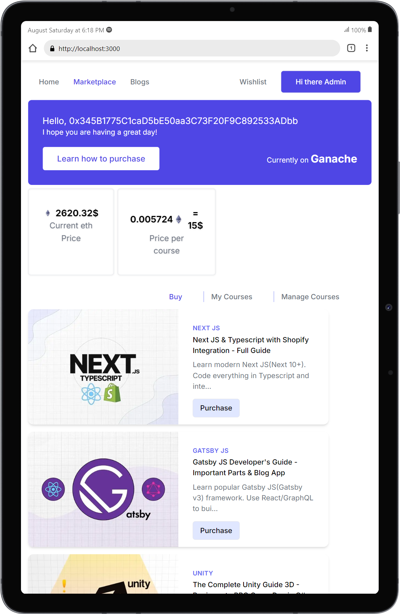

# Course Marketplace ETH

Welcome to **course-marketplace-eth**! This decentralized application (dApp) is built on the Ethereum blockchain, enabling users to purchase, manage, and verify ownership of courses. It leverages smart contracts to handle course purchases, repurchases, and ownership verification.

|  |  |  |
| :----------------------------------------: | :-----------------------------------------: | :----------------------------------------: |

## Live Demo

A live demo of the application is available [here](https://course-marketplace-eth-seven.vercel.app/). You can explore the features of the `course-marketplace-eth` application, including purchasing courses, verifying ownership, and managing courses as an admin.

Make sure to connect your MetaMask wallet to interact with the demo.

## Features

- **Course Listing**: Browse through a variety of available courses.
- **Purchase Courses**: Buy new courses or reactivate existing ones.
- **Ownership Verification**: Verify ownership of purchased courses.
- **Manage Courses**: Admins can activate, deactivate or verify ownership of courses.
- **Blockchain Integration**: Transactions and course data are securely stored on the Ethereum blockchain.

## Technology Stack

- **Frontend**: React, Next.js
- **Blockchain**: Ethereum, Solidity, Truffle
- **Web3 Integration**: Web3.js, MetaMask
- **Styling**: Tailwind CSS
- **State Management**: React Hooks, SWR (for data fetching and mutation)
- **Notifications**: react-toastify

## Prerequisites

Before you begin, ensure you have met the following requirements:

- **Node.js**: Install the latest version of Node.js and npm.
- **MetaMask**: Install the MetaMask browser extension for managing Ethereum accounts.
- **Truffle**: Install Truffle for smart contract management.

## Installation

1. **Clone the repository**:

   ```bash
   git clone https://github.com/kifle23/course-marketplace-eth.git
   cd course-marketplace-eth
   ```

2. **Install dependencies**:

   ```bash
   npm install
   ```

3. **Compile and deploy smart contracts**:

   ```bash
   truffle compile
   truffle migrate --network "sepolia" || "ganache"
   ```

4. **Run the development server**:

   ```bash
   npm run dev
   ```

5. **Access the application**:
   Open [http://localhost:3000](http://localhost:3000) in your browser.

## Environment Variables

Create a `.env.local` file in the root directory and add the following environment variables:

```plaintext
NEXT_PUBLIC_INFURA_API_KEY=your_infura_project_id
NEXT_PUBLIC_CONTRACT_ADDRESS=your_contract_address
NEXT_PUBLIC_ADMIN_ADDRESS_PROD=your_admin_address_in_production
NEXT_PUBLIC_ADMIN_ADDRESS_DEV=your_admin_address_in_development
```

## Usage

1. **Connect MetaMask**: Click on the "Connect Wallet" button to link your Ethereum account.
2. **Browse Courses**: Navigate through the course listings and select the desired course.
3. **Purchase a Course**: Click on "Purchase" to buy the course. Confirm the transaction in MetaMask.
4. **Admin Features**: If you are an admin, you can activate, deactivate or verify courses directly from the course management dashboard.
5. **Verify Ownership**: Enter buyer email in the verification input to confirm ownership of the course.

## Production Deployment

To deploy the application for production:

1. **Build and Start the application**:

   ```bash
   npm run deploy
   ```

2. **Access the application**:
   Open [http://localhost:3000](http://localhost:3000) in your browser.

## Contributing

Contributions are welcome! Please fork the repository and create a pull request with your changes.

## License

This project is licensed under the MIT License. See the [LICENSE](LICENSE) file for details.

